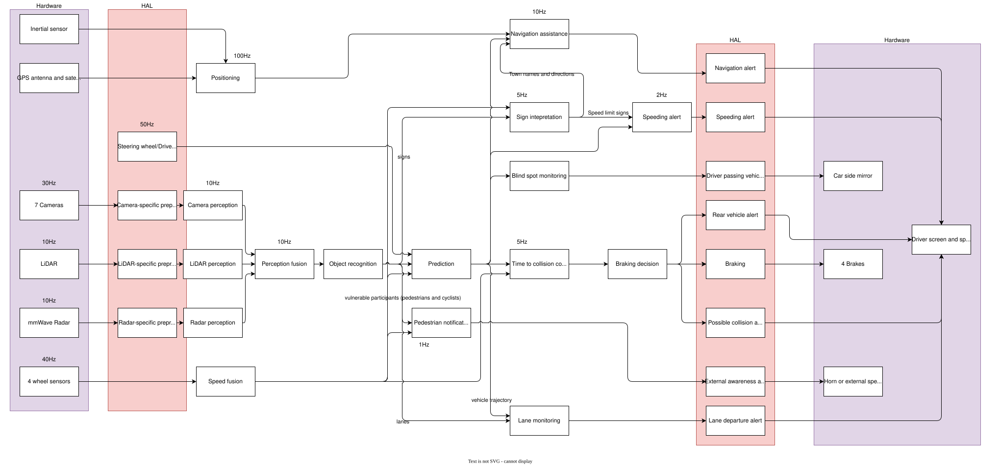
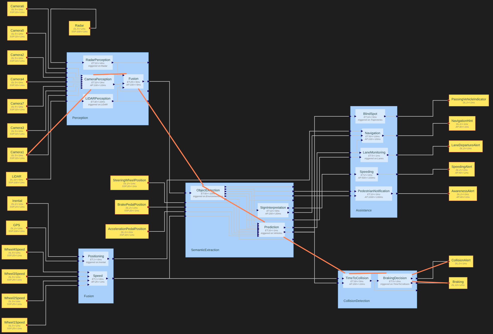
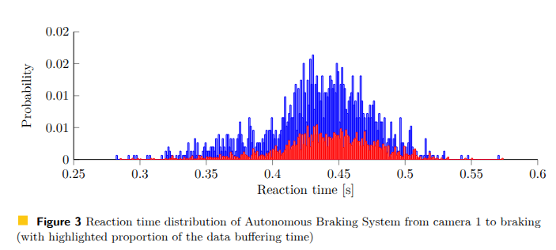
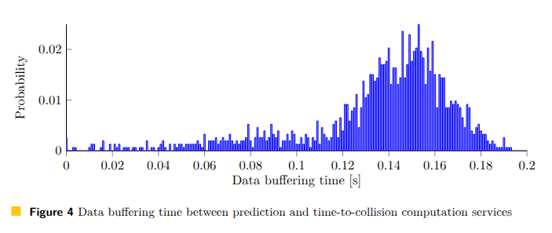
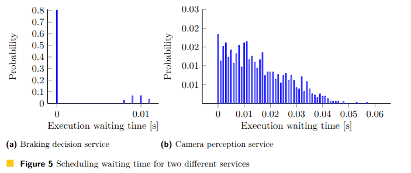
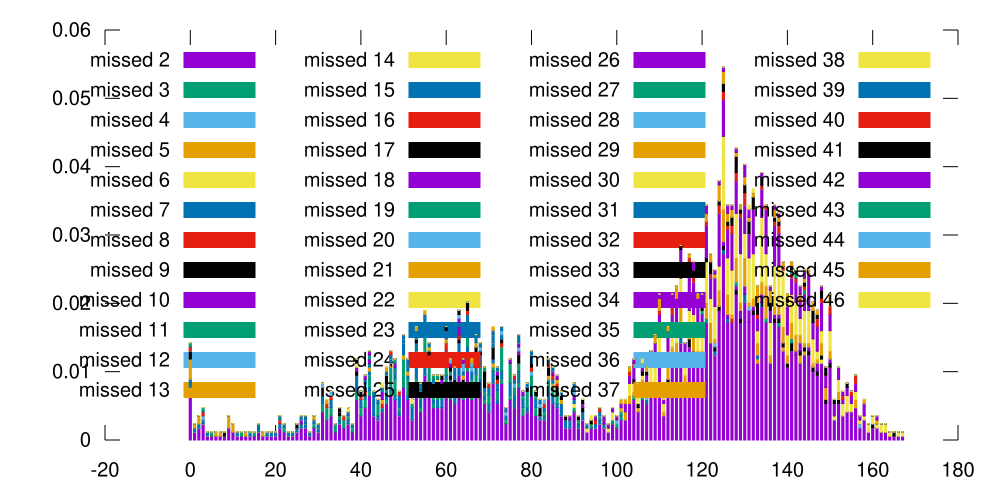
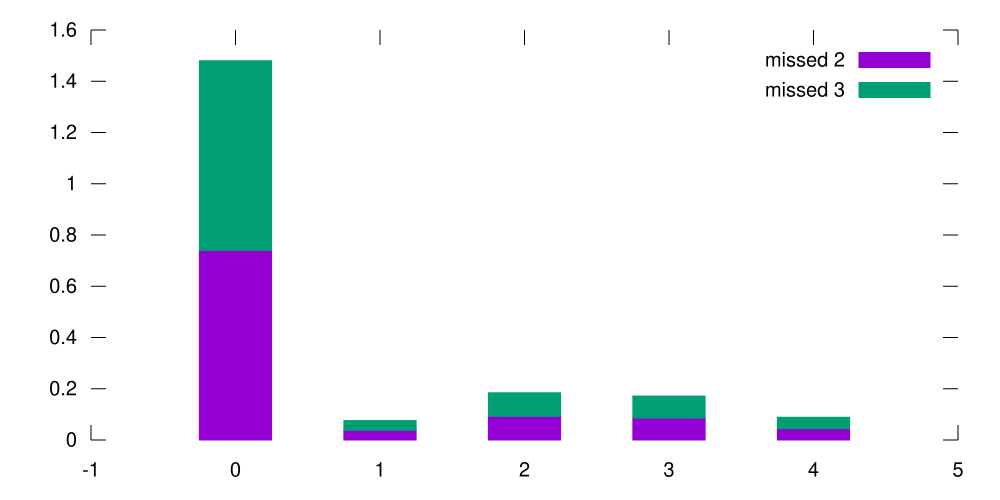
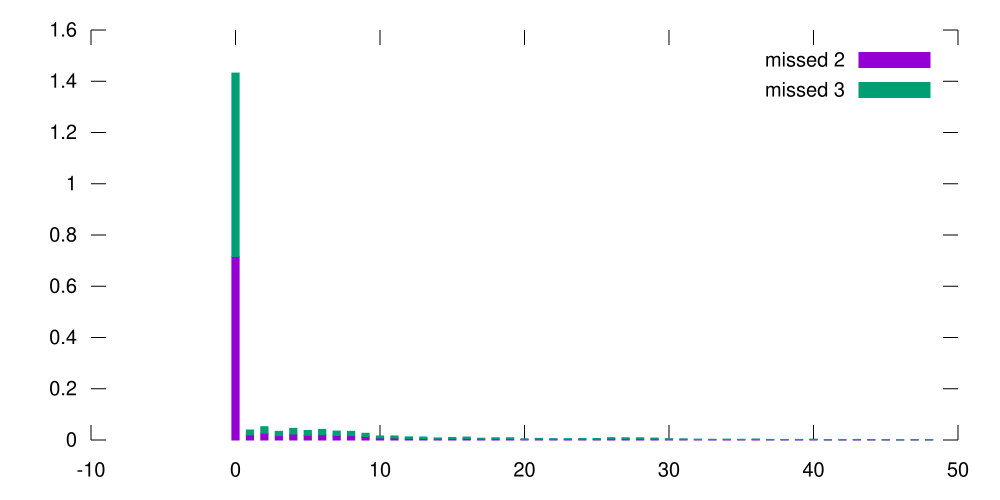

# Complex SDV system demonstration
## How to experiment
- install the DSL plugin in vscode by installing all the dependencies and executing yarn in its repository
- launching debug instance
- open settings and put path to `mrtccsl` installation unless installed in default switch
- locate this directory
- open the [complex.sdvml](./complex.sdvml) file and change some parameters in the description
- press triangle button to run the analysis (this example may several hours)

## System description

To demonstrate both the approach and the scale with which we can work with, we use several applications of Advanced Driver-Assistance System, running at once on a software-defined vehicle (SDV).
The main feature of SDV is service-oriented architecture, used both for safety-critical and non-critical functionality, which allows to share and reuse the same hardware, to be flexibly and differently deployed on different platforms, while still providing the same functionality to the application level.
The features we describe are:
1.  Autonomous emergency braking for forward collision
2. General collision warning (including blind spot monitoring)
3. Warning of approach for vulnerable participants (pedestrians, cyclists) in case of quiet vehicle or/and noisy environment
4. Lane departure monitoring and warning
5. Traffic sign recognition for speeding warning and navigation assistance
6. Lane change assistance with warning in case of passing vehicle (including the blind spots)

Our application consists of many services implementing the functionality and are described in full in Figure 1.
We describe only some characteristics of the services.

> 
> Figure 1. Services, their connections via channels and associated execution periods (missing period implies triggering on data)

> 
> 
> Diagram of the system generated by the DSL plugin in IDE 

In order to implement the autonomous emergency braking, the responsible service makes the decision by testing whenever the current time-to-collision (TTC) satisfies the condition of a dangerous approach.
This condition depends on the current speed of the ego (host) vehicle and braking characteristics (brake force, tire state and quality, road surface, assumed here to be static and sufficiently known during the system's execution).
TTC is computed by another service and requires knowledge of the objects in the scene, their geometry, trajectories and speed, including such of the ego vehicle, as a collision occurs if and only if the ego vehicle and other object have intersecting trajectories, and it can be projected that the objects meet at the intersection at some moment in time.
The instantaneous speed is obtained from the wheel speed sensors, while trajectory and speed evolution can be derived to some success from the current direction, the road geometry and steering wheel position.
For non-ego vehicles, their speed and direction need to be derived from the sequence of the environment reconstructions.
The environment is reconstructed from 7 cameras (2D images), leaving no dead angles around the vehicle, radar in front (low-resolution occupancy image with relative speed of obstacles) and LIDAR on the roof (sparse point cloud).

We consider that the environment reconstruction is online and partial, meaning that the new data from sensors can update the environmental map without needing the data from all sensors to be present at the same time.
This can either mean that the service recomputes the map using the older data for other sensors or performs an intelligent patching of the map.

While we assume that all services run on the same platform, the services are split into disjoint pools that use one execution resource.
In this system, there are 2 GPU processors and 3 CPU cores available.
For example, camera, LiDAR, and radar processing use GPU0, while object detection and sign recognition share GPU1.
On another hand, services representing hardware and drivers connecting them to the service software space via channels, are considered to execute on their own resources with no influence on each other and the described services.

## Functional chains

Functional chains are a crucial concept in descriptions of the real-time systems, as they are the mechanism by which we identify the exact causality relationship between the reaction and its stimulus, and such its duration (end-to-end latency).
Reaction time is the main criteria by which we determine whenever the system satisfies the safety requirements and how good it performs in relation to other designs.
In our work, each of the features define their own functional chain through the services of the system, and the chain specification given with the rest of the system in the same DSL.

Additionally, we use functional chains as a tool to obtain other metrics of interest, such as scheduling wait time.
Our motivation is that while the current functional chain reaction time reporting already includes the waiting times for each link in the chain, the reaction times are biased by the fact that they correspond to the full functional chains.
It thus does not necessarily represent all the jobs of services.
With the scheduling waiting time we can observe the average case of the service waiting for its resource in the system.

## Refinement design approach

While we describe the example system in terms of a DSL that immediately generates the full specification in Stochastic RTCCSL using most of the presented features, the language is designed for more iterative approach in regard to uncertainty.

In the first iteration, we would define the relationships in "big strokes": the causality of the service events.
We say that finish of a task of some service should occur strictly after its matching start, while the task start itself is caused by a matching spawn event.
The spawn events in term are caused by other tasks finishing the execution, or periodic behaviour, which cannot be described as just causality constraint.

Next we make precise that the causality is not arbitrary in the case of task execution: it is continuous use of a resource and is measured in real time.
This means that each task execution is expressed as a real-time delay constraint and is associated with a numerical sequence of its execution time.
The execution time at this point is assumed to be some unrestricted numerical sequence.

When it is known in which interval of values the execution time for specific service can be assumed to hold, the numerical sequence constraints are added.
Finally, when it is known how execution time is distributed, we refine the numerical sequence with the stochastic constraint with a specific distribution, completing the specification of the uncertainty.
Same process is conducted for the periodic triggering of the service tasks, corresponding periodic constraints and their jitter arguments, independently of each other.

## Experimental results
After describing the system in [terms of the DSL](./complex.sdvml), we generate a number of traces that satisfy the generate specification by using the Stochastic RTCCSL and our implementation in [OCaml](https://github.com/PaulRaUnite/mrtccsl).
We collect the results in the form of reaction time distributions, some of which we demonstrate in Figures 2-4.

> 
> 
> Figure 2. Reaction time distribution of Autonomous Braking System from camera 1 to braking (with highlighted proportion of the data buffering time)

> 
> 
> Figure 3. Data buffering time between prediction and time-to-collision computation services 

As we can see from Figure 2, the reaction time from observing the obstacle in the camera and reaction by braking is at most 0.55 seconds, most probably between 0.4 to 0.5 seconds.
This is not satisfactory, and by looking at the individual contributions to the reaction time on the figure, and then closer in Figure 3, we can determine that data buffering time, i.e. time of data being available but not consumed, between prediction and time-to-collision services, significantly contributes to the late reaction time (at most 0.19s).
We can propose 2 ways to improve the reaction: either we switch the service from periodic activation to event-triggering on data, which will increase the resource consumption, or decrease the period.

> 
> 
> Figure 4. Scheduling waiting time for two different services
>   - a) Braking decision service
>   - b) Camera perception service

On another hand, from Figure 4a we can determine that the braking decision service is scheduled mostly immediately in $\approx 80\%$ of cases and with 8-11ms delay otherwise.
For the camera perception service, in Figure 4b, the waiting time for execution may reach 50ms, which should hint to a revision of the resource allocation for the service.

Similar results can be found in the repository in a less refined state and with arbitrary scale (seems to be a bug in gnuplot):
- 
- 
- 
- 