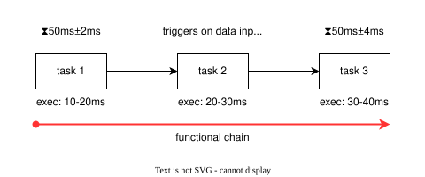
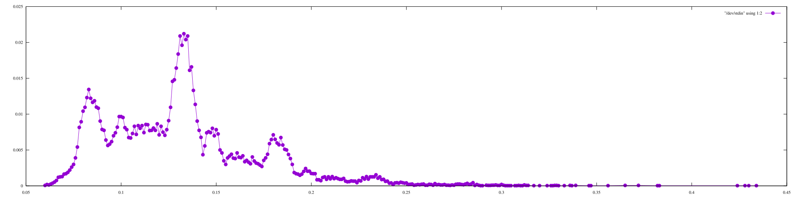
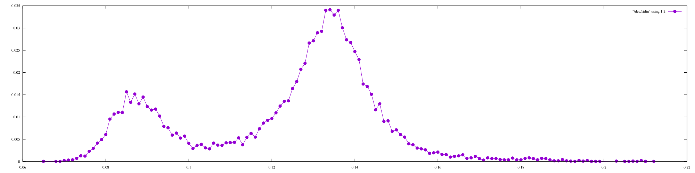
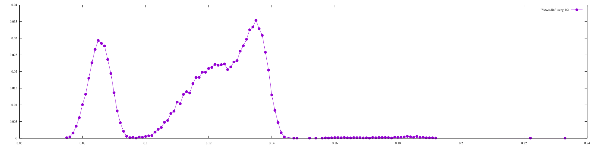
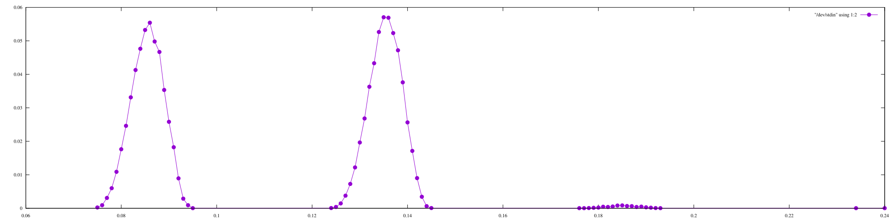

# Refinement demonstration

## How to experiment
- change something in one of the modules ([M0.mrtccsl](./M0.mrtccsl), [M1.mrtccsl](./M1.mrtccsl), [M2sim.mrtccsl](./M2sim.mrtccsl), [M21.mrtccsl](./M21.mrtccsl) or [M22.mrtccsl](./M22.mrtccsl))
    - [the syntax reference](https://github.com/PaulRaUnite/mrtccsl/blob/ecrts2026/lib/mrtccslparsing/syntax.ebnf)
- or add a new one: requires adding the name in scripts [generate.sh](./generate.sh), [analysis.sh](./analysis.sh) and [visualize.sh](./visualize.sh)
- run `bash all.sh` to run analysis on all modules

## System description

- 3 tasks
- tasks 1 and 3 and periodic with period `50ms`, jitter `+-2ms` and `+-4ms` respectively
- task 2 is event-triggered on data produced when task 1 finishes
- execution time is `10ms-20ms`, `20ms-30ms` and `30ms-40ms` respectively

## Module refinement
After performing the analysis which consists of generating trace, extracting the functional chains, computing reaction time, we aggregate the results into reaction time histograms below, one for each module in the refinement steps.

Refinement steps:
1. [$M$](./M0.mrtccsl): causality only
    
2. [$M'$](./M1.mrtccsl): real-time behaviour and bounds on numerical sequences
    
3. Stochastic real-time behaviour as additional stochastic expressions on numerical sequences.
Scheduling alternatives:
    - [$M''_\sim$](./M2sim.mrtccsl): stochastic scheduling
        
    - [$M''_1$](./M21.mrtccsl): explicit resource and scheduling (but no task priority)
        
    - [$M''_2$](./M22.mrtccsl): no resource, jobs start when released
        
